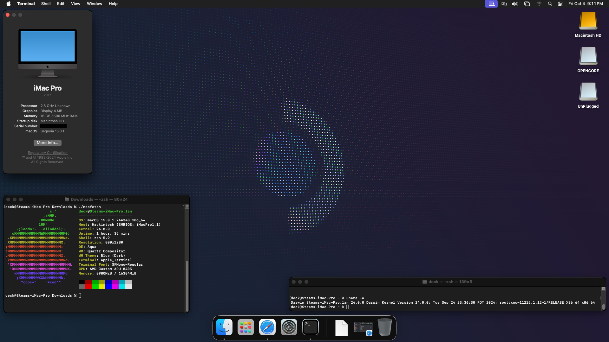
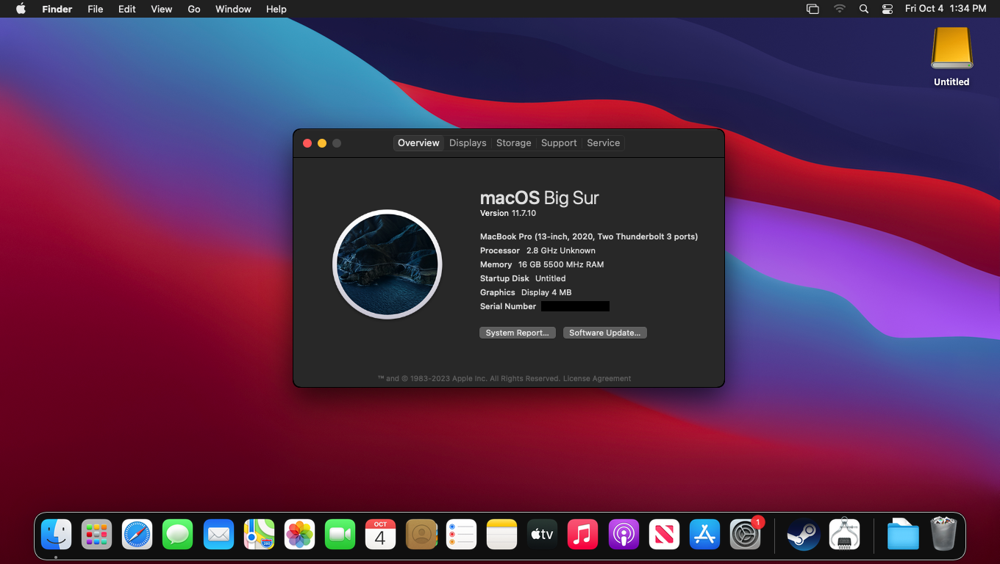

  

<h2 align="center">Steam Decks</h2>

  <h3 align="center">
    macOS Sequoia 15.0.1 (Credits: 
    <a href="https://github.com/irlbunny">@irlbunny</a>)
  </h3>
  

  <h3 align="center">
    macOS Big Sur 11.7.10 (Credits: 
    <a href="https://github.com/CodeRunner5235">@CodeRunner5235</a>)
  </h3>
  

