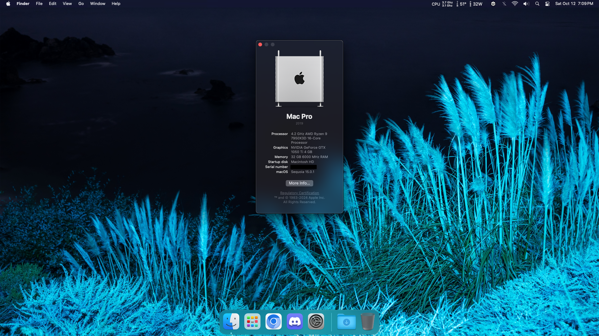
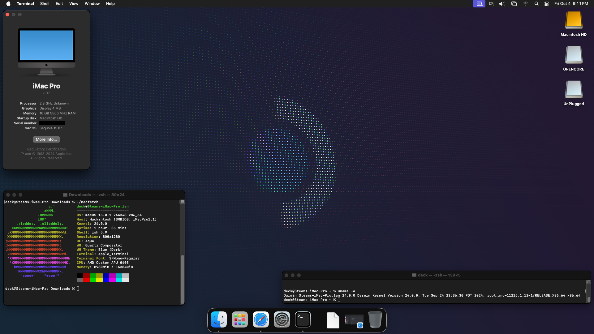
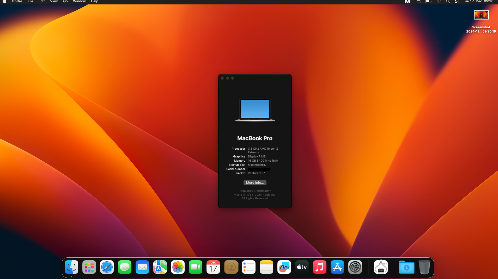
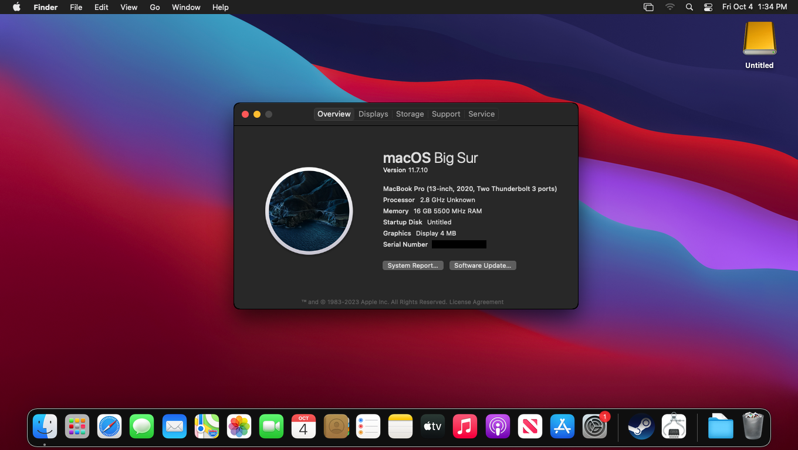

  

<h2 align="center"><b>Mac Pro (2019)</b></h2>
<h5 align="center"><i>MacPro7,1</i></h5>

  <h3 align="center">
    macOS Sequoia 15.0.1 on AMD Ryzen 9 7950X3D (Credits: 
    <a href="https://github.com/whatdahopper">@whatdahopper</a>)
  </h3>
  

<h2 align="center"><b>iMac Pro (2017)</b></h2>
<h5 align="center"><i>iMacPro1,1</i></h5>

  <h3 align="center">
    macOS Sequoia 15.0.1 on Steam Deck LCD (Credits: 
    <a href="https://github.com/whatdahopper">@whatdahopper</a>)
  </h3>
  

<h2 align="center"><b>MacBook Pro (2020)</b></h2>
<h5 align="center"><i>MacBookPro16,3</i></h5>

  <h3 align="center">
    macOS Ventura 13.7 on ROG Ally RC71L (2023) (Credits: 
    <a href="https://github.com/B-Waffles">@B-Waffles</a>)
  </h3>
  

  <h3 align="center">
    macOS Big Sur 11.7.10 on Steam Deck LCD (Credits: 
    <a href="https://github.com/CodeRunner5235">@CodeRunner5235</a>)
  </h3>
  

